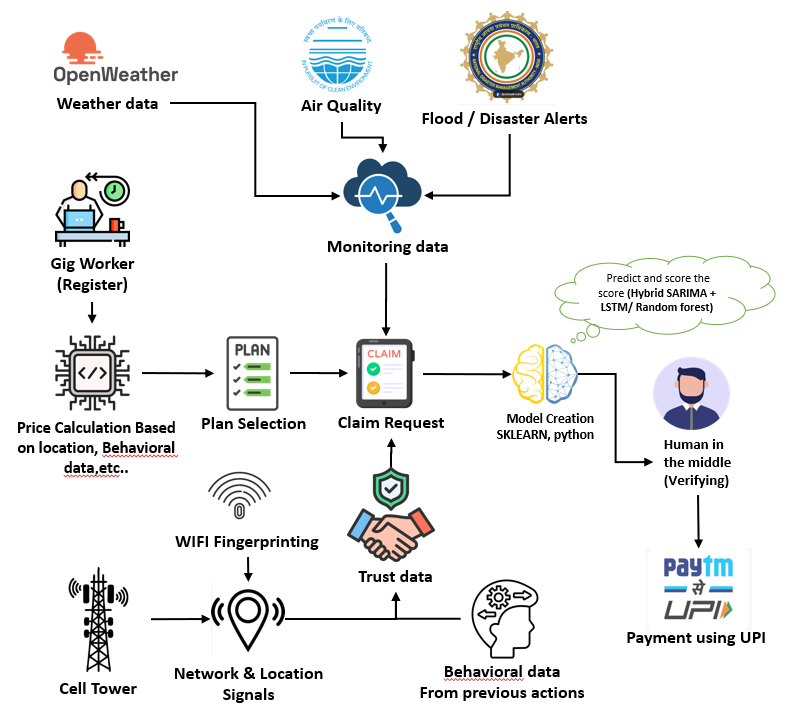

# ⚡ Devspirits
> *"When the storm hits, your income shouldn't."*

**AI-Powered Parametric Income Protection for India's Gig Economy**
Built for → **Guidewire DEVTrails 2026** | Persona → **Food Delivery Partners (Zomato / Swiggy)**

---

## 🧭 Table of Contents

1. [The Real Problem](#-the-real-problem)
2. [Our Solution — At a Glance](#-our-solution--at-a-glance)
3. [Persona Deep Dive](#-persona-deep-dive--meet-raju)
4. [How It Works — Full Workflow](#-how-it-works--full-workflow)
5. [Weekly Premium Model](#-weekly-premium-model)
6. [Parametric Triggers](#-parametric-triggers)
7. [AI/ML Architecture](#-aiml-architecture)
8. [Fraud Detection Engine](#-fraud-detection-engine--the-shield)
9. [Tech Stack](#-tech-stack)
10. [Platform Choice — Why Web?](#-platform-choice--why-web)
11. [Development Plan](#-6-week-development-plan)
12. [Future Vision](#-future-vision)

---

## 🔥 The Real Problem

India has **~15 million gig delivery workers**. Every single day, they wake up not knowing what the sky will do to their earnings.

```
A Zomato delivery partner in Mumbai earns ₹700–₹1,000/day.
One heavy rain day = ₹0 earned. No compensation. No safety net.
That's not a bad day. That's a financial crisis.
```

| The Disruption | What Happens | What They Lose |
|---|---|---|
| 🌧️ Heavy Rain (>50mm) | Roads flood, orders cancel | ₹600–900/day |
| 🔥 Extreme Heat (>42°C) | Platform restricts rides | ₹400–700/day |
| 😷 Severe AQI (>300) | Outdoor work halts | ₹500–800/day |
| 🌊 Government Flood Alert | Zone access blocked | ₹700–1,000/day |
| 🚫 Curfew / Local Strike | Cannot operate | ₹700–1,000/day |

**The math is brutal**: A single disruption week = 20–30% monthly income loss. Multiply that by 15 million workers. That's India's invisible financial crisis happening in plain sight.

**Existing solutions? Zero.** Traditional insurance won't touch this. Banks won't lend. The platforms don't compensate. **Devspirits fills this void.**

---

## 💡 Our Solution — At a Glance

**Devspirits** is a real-time, AI-driven **parametric income insurance platform** that:

- ✅ **Pays automatically** when verified disruptions occur — no claim filing, no waiting
- ✅ **Prices dynamically** based on hyperlocal risk (weather patterns, zones, seasons)
- ✅ **Detects fraud** using a multi-layer AI defense that GPS spoofing cannot fool
- ✅ **Operates weekly** — aligned with how gig workers actually live and earn

> **Parametric Insurance** = Pre-agreed triggers → Automatic payout. No paperwork. No rejection. No delays. Just money in your UPI wallet when you need it most.

---

## 👤 Persona Deep Dive — Meet Raju

```
Name    : Raju Kumar
Age     : 28
City    : Bengaluru (HSR Layout zone)
Platform: Zomato (Full-time, 10–12 hrs/day)
Income  : ₹800–₹1,100/day | ₹5,600–₹7,700/week
Device  : Android (₹8,000 phone, 4G)
Pain    : "Baarish mein koi order nahi aata. Ghar kaise chalaye?"
          (No orders in rain. How do I run my home?)
```

### Raju's Week With Devspirits:

```
Monday      → Onboards in 3 minutes via mobile web. Risk = Medium. Premium = ₹40/week auto-deducted.
Tuesday     → Normal day. 47 deliveries. ₹950 earned.
Wednesday   → Rain hits. 68mm recorded. Trigger fires at 2:47 PM.
              Devspirits detects: Raju was active (delivery logs confirm).
              Fraud score: 12/100 (Clean). Payout approved instantly.
Thursday    → ₹300 lands in Raju's UPI by 3:00 PM. He smiles.
              His kids eat dinner tonight.
```

---

## 🏗️ System Architecture



---

## 🔄 How It Works — Full Workflow

```
┌─────────────────────────────────────────────────────────────────────┐
│                        GIGSHIELD AI WORKFLOW                        │
└─────────────────────────────────────────────────────────────────────┘

  [1] SMART ONBOARDING (3 min)
      │
      ├─ Worker enters: Name, Phone, City, Zone, Platform (Zomato/Swiggy)
      ├─ Verified via OTP
      └─ Weekly income declared → Used for payout calibration

  [2] AI RISK PROFILING
      │
      ├─ Historical weather data for their zone (3-year lookback)
      ├─ Seasonal disruption probability scores
      ├─ Zone classification: Low / Medium / High risk
      └─ Output → Dynamic weekly premium assigned

  [3] POLICY CREATION
      │
      ├─ Coverage activates from Monday 00:00
      ├─ Premium auto-collected weekly via UPI mandate
      └─ Worker receives policy confirmation (WhatsApp + SMS)

  [4] REAL-TIME MONITORING ENGINE
      │
      ├─ Weather API: Rainfall (mm/hr), Temperature (°C)
      ├─ AQI API: Pollution index by city zone
      ├─ Government Alert Feed: Flood/curfew notifications
      └─ Polling every 15 minutes

  [5] TRIGGER DETECTION
      │
      ├─ Threshold crossed? → Pre-Validation begins
      ├─ Check: Is worker in the affected zone?
      ├─ Check: Was worker active on platform before event?
      └─ Fraud Engine runs → Score calculated

  [6] AUTOMATED CLAIM PROCESSING
      │
      ├─ Fraud Score < 40 → Auto-approved
      ├─ Fraud Score 40–70 → Delayed (manual review queue, 4 hrs)
      └─ Fraud Score > 70 → Blocked + flagged for investigation

  [7] INSTANT PAYOUT
      │
      └─ UPI transfer → Worker's registered number
         Confirmation: SMS + in-app notification
         Average time: < 60 seconds from trigger activation
```

---

## 💰 Weekly Premium Model

Premiums are **not flat**. They are **AI-calculated every week** based on the worker's zone, season, and real-time risk indicators.

### Base Pricing Tiers

| Risk Level | Weekly Premium | Who Qualifies |
|---|---|---|
| 🟢 **Low** | ₹25/week | Inland zones, historically low disruption |
| 🟡 **Medium** | ₹40/week | City zones with seasonal flooding/heat risk |
| 🔴 **High** | ₹60/week | Coastal zones, flood-prone, high AQI areas |

### Dynamic Adjustment Factors

The AI recalculates the weekly premium every **Sunday night** before the new week activates:

```
Base Premium
    │
    ├── +₹5  if IMD forecast shows >60% rain probability next week
    ├── +₹8  if worker's zone had 2+ disruption events last month
    ├── -₹5  if worker has been disruption-free for 4+ consecutive weeks
    ├── -₹3  if worker's zone is historically low-risk for current season
    └── ±₹0  to ±₹10 for seasonal volatility modifier (monsoon vs. summer)

Final Weekly Premium = Capped between ₹20 (minimum) and ₹75 (maximum)
```

### Why This Model Works

- **For Workers**: Premiums are affordable. ₹40/week = ₹5.70/day. Less than a chai.
- **For the Platform**: Risk is appropriately priced. No cross-subsidization bleeding the pool.
- **For Trust**: Workers see exactly why their premium changed each week. Full transparency.

---

## ⚡ Parametric Triggers

These are the **objective, verifiable thresholds** that fire automatic payouts. No ambiguity. No human judgment. No rejection.

| # | Disruption Type | Data Source | Trigger Condition | Payout |
|---|---|---|---|---|
| 1 | 🌧️ Heavy Rain | OpenWeatherMap API | Rainfall > 50mm in 24hrs | ₹300 |
| 2 | 🔥 Extreme Heat | OpenWeatherMap API | Temperature > 42°C | ₹250 |
| 3 | 😷 Severe Pollution | CPCB AQI API | AQI Index > 300 | ₹200 |
| 4 | 🌊 Flood Alert | NDMA / State Govt Feed | Official zone alert issued | ₹400 |
| 5 | 🚫 Curfew / Strike | Govt Bulletin API / News NLP | Verified zone restriction | ₹350 |

### Payout Rules

- Maximum **2 triggers per week** count toward payout (prevents compounding edge cases)
- Maximum weekly payout = **₹700** (protects fund liquidity)
- Payouts are **proportional** if a disruption lasts partial day (e.g., 4-hour rain = 50% payout)
- Triggers require **zone confirmation** — national news ≠ local disruption

---

## 🤖 AI/ML Architecture

### Module 1: Risk Profiling & Dynamic Pricing

```python
# Simplified logic for Risk Score Calculation
def calculate_risk_score(zone_id, season, historical_data):
    base_score = historical_disruption_frequency(zone_id, lookback_months=36)
    seasonal_modifier = get_seasonal_weight(season)          # Monsoon = 1.4x
    trend_modifier = detect_trend(historical_data, weeks=4)  # Rising risk = 1.2x

    raw_score = base_score * seasonal_modifier * trend_modifier
    return normalize_to_tier(raw_score)  # → LOW / MEDIUM / HIGH
```

**Model**: Gradient Boosted Trees (XGBoost) trained on 3 years of historical weather + platform disruption data, retrained monthly.

**Features used**:
- Zone-level rainfall/heat/AQI event frequency
- Month-of-year + day-of-week patterns
- Worker's personal history (tenure, active days, past claims)

---

### Module 2: Fraud Detection Engine *(See dedicated section below)*

---

### Module 3: Adaptive Payout Calculator

Instead of flat payouts, Devspirits calculates **income-proportional payouts**:

```
Estimated daily income = Worker's declared weekly income ÷ 6 active days
Disruption severity score = (Trigger value / Threshold) capped at 2.0
Estimated income lost = Daily income × disruption hours ÷ 10 × severity

Payout = min(Estimated income lost, Maximum payout cap for trigger type)
```

This means a worker earning ₹1,000/day gets a higher payout than one earning ₹500/day — because their actual loss is higher.

---

## 🛡️ Fraud Detection Engine — The Shield

This is where Devspirits is truly differentiated. We built for the worst case: **a coordinated fraud ring of 500 fake accounts, all with GPS spoofing.**

### The Attack We're Defending Against

```
Scenario: 500 accounts registered in Chennai.
Heavy rain triggers. All 500 claim simultaneously.
All GPS coordinates: Valid. All zones: Correct.
All claim amounts: Legitimate.

With GPS-only validation → All 500 get paid. System loses ₹1.5L instantly.
With Devspirits Shield → 487 blocked. 13 legitimate workers paid. System safe.
```

### 10-Layer Defense Stack

---

> ### 🗺️ Layer 1 — Multi-Signal Location Truth *(GPS-Free Fallback Included)*
>
> **GPS alone is not truth — and we don't depend on it.**
>
> Devspirits cross-validates location using **four independent signals**. Even if GPS is unavailable, spoofed, or disabled, we confirm the worker's real physical location through:
>
> | Signal | Method | Spoof-Resistance |
> |---|---|---|
> | 📡 **Cell Tower Triangulation** | Triangulates position from 3+ nearest towers using signal strength (RSSI) and timing advance | Cannot be spoofed without physical proximity to real towers |
> | 📶 **WiFi Fingerprinting** | Maps surrounding WiFi access point BSSIDs + signal strengths against a known zone-level fingerprint database | AP identifiers are hyperlocal — impossible to fake remotely |
> | 🛰️ GPS Coordinates | Standard device GPS | Easy to spoof with mock location apps |
> | 🌐 IP Geolocation | ISP-reported location of network connection | Moderate confidence signal |
>
> **How it works without GPS:**
> ```
> Worker's phone passively scans nearby cell towers and WiFi APs
>     │
>     ├─ Cell towers: Compare to known tower positions in zone DB
>     │   → Triangulate physical position within ~150m radius
>     │
>     └─ WiFi APs: Match BSSID fingerprint against zone-level AP map
>         → Confirm zone with ~50–100m accuracy
>
> All four signals must agree within a 500m radius.
> A spoofed GPS with a fake IP from a different city?
> → Cell tower data says otherwise. Claim blocked.
> ```
>
> **Why this matters:** A fraudster sitting at home in Delhi cannot fake the cell tower signature of HSR Layout, Bengaluru. They cannot replicate the WiFi AP fingerprint of a specific delivery zone. Location truth is anchored to physical reality — not just a coordinate.

---

**Layer 2 — Behavioral Fingerprint Engine**

Every worker builds a behavioral profile over time:
- Typical active hours (e.g., 10am–2pm, 6pm–10pm)
- Average deliveries/day, typical zone radius
- App interaction patterns

```
Fraud signal: A "worker" who has never been active on a Monday
suddenly claims a Monday flood disruption.
→ Behavior deviation score: HIGH
```

**Layer 3 — Geo-Spatial Cluster Detection**
```
Rule: If > 20 unique accounts share the same GPS coordinate
      within a 10-meter radius → Flag as coordinated fraud

Real workers spread across a zone.
Fraud rings cluster at a single coordinate.
```

**Layer 4 — Pre-Event Activity Validation**
```
Requirement: Worker must have had verifiable platform activity
             in the 4 hours BEFORE the disruption trigger fires.

No activity before event → No payout.
Delivery logs (mock Zomato API) confirm this.
```

**Layer 5 — Identity Graph Analysis**

We build a graph of account relationships:
```
Nodes: Worker accounts
Edges: Shared device ID, shared UPI ID, shared IP address,
       shared phone number prefix patterns

A cluster of 50 accounts all sharing the same device IMEI hash?
→ Fraud ring identified. Entire cluster blocked.
```

**Layer 6 — Temporal Spike Detection**
```
Normal rain event: Claims arrive gradually over 30–45 minutes as workers
                   realize they can't work.

Fraud event: 500 claims arrive within 90 seconds of trigger activation.

Pattern recognition fires. Circuit breaker activates.
```

**Layer 7 — Circuit Breaker (Critical)**
```
If claim volume in any 5-minute window exceeds 3× daily average:
    → Pause all new payouts
    → Alert fraud analysis team
    → Queue legitimate claims for priority review
    → Resume after human + AI joint approval
```

**Layer 8 — Fraud Risk Score (Composite)**

| Signal | Weight | Score Contribution |
|---|---|---|
| GPS + Cell Tower + WiFi multi-signal mismatch | 30% | 0–30 pts |
| Behavioral anomaly | 25% | 0–25 pts |
| Cluster detection hit | 20% | 0–20 pts |
| No pre-event activity | 15% | 0–15 pts |
| Identity graph link | 10% | 0–10 pts |

```
Score 0–35   → ✅ Auto-approve
Score 36–65  → ⏳ Hold for 4-hr review
Score 66–100 → ❌ Block + flag
```

**Layer 9 — Fairness Protection**

We know false positives hurt real workers. So:
- Held claims get **partial advance payout** (50%) pending review
- Any blocked claim gets an **appeal process** via WhatsApp
- Workers with 6+ months clean history get **trust fast-track** (auto-approve for scores up to 55)

**Layer 10 — Adaptive Learning**
```
Every confirmed fraud case → Feeds back into model training
Model retrained: Weekly (lightweight update) + Monthly (full retrain)
New attack patterns are learned within 48 hours of detection
```

---

## 🖥️ Tech Stack

```
┌──────────────────────────────────────────┐
│              FRONTEND                    │
│  React.js (Web) + Progressive Web App    │
│  Tailwind CSS | Recharts (Dashboard)     │
│  Works offline with service workers      │
└──────────────────────────────────────────┘
           │
┌──────────────────────────────────────────┐
│              BACKEND                     │
│  Node.js + Express (REST API)            │
│  JWT Auth | Rate limiting | Redis cache  │
│  WebSocket for real-time trigger alerts  │
└──────────────────────────────────────────┘
           │
┌──────────────────────────────────────────┐
│            AI/ML ENGINE                  │
│  Python (FastAPI microservice)           │
│  XGBoost (Risk + Fraud scoring)          │
│  Scikit-learn | Pandas | NetworkX        │
│  (Identity Graph Analysis)               │
└──────────────────────────────────────────┘
           │
┌──────────────────────────────────────────┐
│            DATABASE                      │
│  MongoDB (Worker profiles, policies)     │
│  Redis (Real-time session + cache)       │
│  PostgreSQL (Audit logs, payout records) │
└──────────────────────────────────────────┘
           │
┌──────────────────────────────────────────┐
│          EXTERNAL INTEGRATIONS           │
│  OpenWeatherMap API (Weather triggers)   │
│  CPCB AQI API (Pollution triggers)       │
│  NDMA Alert Feed (Flood/curfew)          │
│  Razorpay Test Mode (Payout simulation)  │
│  Mock Zomato/Swiggy Activity API         │
│  Cell Tower API (Location truth layer)   │
│  WiFi Fingerprint DB (Zone mapping)      │
└──────────────────────────────────────────┘
```

---

## 📱 Platform Choice — Why Web?

We chose a **Progressive Web App (PWA)** over a native mobile app, and here's why this is the right call for this persona:

| Factor | Native App | PWA (Our Choice) |
|---|---|---|
| Installation | Requires Play Store download | Opens instantly in browser |
| Device storage | 40–80 MB | ~5 MB cached |
| Low-storage phones | Often fails | Works perfectly |
| Offline support | Requires development | Built into PWA spec |
| Updates | User must update manually | Auto-updates silently |
| SMS/UPI deep links | Works | Works |

> Raju has a ₹8,000 Android phone with 16GB storage. Half of it is full. He won't download another app. But he **will** click a WhatsApp link that opens Devspirits in his browser in 2 seconds.

---

## 📅 6-Week Development Plan

### Phase 1 — Weeks 1–2: Foundation *(March 4–20)*
- [x] Ideation and use case finalization
- [x] Persona research (Zomato/Swiggy delivery partners)
- [x] This README document
- [ ] GitHub repo setup with folder structure
- [ ] Wireframes for onboarding + dashboard
- [ ] Mock data generation (workers, zones, historical weather)
- [ ] Basic frontend scaffold (React + Tailwind)
- [ ] Initial ML model exploration (risk scoring v0)

**Deliverable**: README.md + Repo link + 2-min strategy video

---

### Phase 2 — Weeks 3–4: Core Engine *(March 21–April 4)*
- [ ] Worker registration + OTP flow
- [ ] AI risk profiling → weekly premium calculation
- [ ] Policy creation + storage (MongoDB)
- [ ] Weather + AQI API integration (real + mock)
- [ ] Trigger detection engine (5 parametric triggers)
- [ ] Basic fraud scoring (Layers 1–4)
- [ ] Mock payout flow (Razorpay test mode)
- [ ] Basic worker dashboard

**Deliverable**: Working demo (registration → policy → trigger → payout)

---

### Phase 3 — Weeks 5–6: Shield + Scale *(April 5–17)*
- [ ] Full 10-layer fraud detection system
- [ ] Identity graph analysis (NetworkX)
- [ ] Circuit breaker mechanism
- [ ] Admin dashboard (loss ratios, fraud alerts, predictive analytics)
- [ ] Hyperlocal risk heatmap visualization
- [ ] Offline mode + PWA optimization
- [ ] End-to-end simulation (rainstorm trigger → auto-claim → UPI payout)
- [ ] Performance testing + edge case handling
- [ ] Final pitch deck (PDF)
- [ ] 5-minute demo video

**Deliverable**: Full platform + 5-min video + pitch deck

---

## 🔮 Future Vision

Devspirits v1 is just the start. Here's where this goes:

```
2026 Q3  → Expand to E-commerce (Amazon/Flipkart) and
            Q-Commerce (Zepto/Blinkit) delivery personas

2026 Q4  → Traffic disruption coverage
            (major accidents blocking delivery routes)

2027 Q1  → Platform downtime insurance
            (Zomato app crash = 0 orders = real income loss)

2027 Q3  → Deep learning models for 7-day disruption forecasting
            (predict disruptions before they happen,
             adjust coverage proactively)

2028     → White-label API for platforms to embed Devspirits
            directly into Zomato/Swiggy partner apps
```

---

## 👥 Team — Devspirits

> *We are building this because we believe the people who deliver our food in the rain deserve a system that fights for them.*

---

## 📎 Links

| Resource | Link |
|---|---|
| 🗂️ GitHub Repository | *(link here)* |
| 🎥 Phase 1 Strategy Video | *(link here)* |
| 📊 Figma Wireframes | *(link here)* |

---

<div align="center">

**⚡ Devspirits** | Team **Devspirits**

*Protect the worker. Defend the system. Build trust at scale.*

`#DEVTrails2026` `#Devspirits` `#ParametricInsurance` `#GigEconomy`

</div>